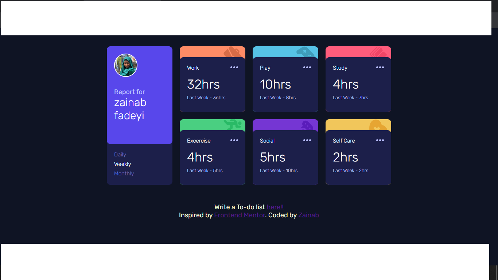

# ALX FINAL APP PROJECT
# MY TIME TRACKER AND TO DO LIST APP

## Welcome! 👋

## Introduction
This Time Tracker and To-Do List App is designed for your ALX final project. It helps you organize and manage your time effectively by allowing you to create and track tasks, set deadlines, and monitor your progress. Whether you are a student, professional, or anyone looking to organize their tasks and time better, this app is designed to make your life easier

### Features
1.Knowing how you manage your time for different activities

2.Create and manage tasks

3.Edit and delete tasks

4.Organize tasks into categories or projects

5.Responsive design for mobile and desktop

### Prerequisites
Basic knowledge of HTML, CSS, and JavaScript.
A code editor (e.g., Visual Studio Code).
A modern web browser (e.g., Google Chrome).

Insiped by front-end coding challenge.

[Frontend Mentor](https://www.frontendmentor.io) challenges help you improve your coding skills by building realistic projects.

